# 🌾 CropDeal — Enterprise Agricultural Marketplace & Supply Chain Platform

[](https://www.oracle.com/java/)
[](https://spring.io/projects/spring-boot)
[](https://spring.io/projects/spring-cloud)
[](https://angular.dev/)
[](https://www.rabbitmq.com/)
[](https://www.mysql.com/)
[](https://martinfowler.com/bliki/CQRS.html)
[](LICENSE)

---

## 📌 Executive Summary

**CropDeal** is an enterprise-grade, distributed B2B AgriTech e-commerce, auction bidding, and supply chain logistics platform engineered with a **microservices architecture** using **Spring Boot 3.3.13**, **Spring Cloud 2023.0.6**, and an **Angular 18+ Standalone** responsive web client.

The platform eliminates exploitative agricultural middlemen by providing a transparent, direct digital corridor between **Farmers (Producers)**, **Dealers (Commercial Buyers)**, **Logistics & Delivery Partners**, and **Platform Administrators**. 

Equipped with **live Government of India Mandi price benchmarks (AGMARKNET)**, **CQRS (Command Query Responsibility Segregation)** in core domains, dynamic price bargaining, live real-time auction bidding floors, automated Rule 46 CGST tax invoicing, dual-fulfillment logistics, and distributed audit tracking, CropDeal delivers a robust, secure, and production-ready solution for digital agriculture.

---

## 🏛️ System Architecture & CQRS Implementation

CropDeal adheres to the **Database-per-Service** design pattern, ensuring complete domain autonomy, zero schema coupling, horizontal scalability, and resilience across the entire microservice ecosystem.

```mermaid
flowchart TD
    subgraph Client_Layer [Client Layer]
        UI["Angular 18+ Web Application<br/>(Port 4200)<br/>• Role Dashboards • Glassmorphism UI"]
    end

    subgraph Gateway_Discovery [Gateway & Service Discovery Mesh]
        EUREKA["Netflix Eureka Server<br/>(Port 8761)<br/>Service Registry & Heartbeat"]
        CONFIG["Spring Cloud Config Server<br/>(Port 8888)<br/>Centralized Native Config"]
        GATEWAY["Spring Cloud API Gateway<br/>(Port 8080)<br/>Reverse Proxy • JWT Filter • CORS Policy"]
    end

    subgraph Event_Broker [Asynchronous Event Bus]
        RABBIT["RabbitMQ Message Broker<br/>(Port 5672 / Management: 15672)<br/>• Price Alerts • Delivery Milestones • Outbid Signals"]
    end

    subgraph Core_Microservices [Domain Microservices Cluster]
        AUTH["auth-service (8081)<br/>JWT • BCrypt • RBAC"]
        USER["user-service (8082)<br/>Profiles • KYC • Bank Settlement"]
        CROP["crop-service [CQRS] (8083)<br/>Command & Query Segregation"]
        PRICE["price-service (8084)<br/>37,800+ APMC Mandi Records"]
        NEG["negotiation-service (8085)<br/>Direct Price Bargaining Engine"]
        BID["bidding-service [CQRS] (8086)<br/>Real-Time Auction Floor"]
        WALLET["wallet-service (8087)<br/>Optimistic Lock Escrow Wallet"]
        ORDER["order-service (8088)<br/>Order Placement & Inventory Depletion"]
        PAY["payment-service (8089)<br/>Payment Capture & Audit Stamps"]
        INV["invoice-service (8090)<br/>OpenPDF Rule 46 CGST Tax Invoicing"]
        DEL["deliveryservice (8091)<br/>Global Delivery Pool & Logistics"]
        NOTIF["notification-service (8092)<br/>Event-Driven In-App Alerts"]
        ALERT["price-alert-service (8094)<br/>Target Price Subscriptions"]
        REPORT["report-service (8095)<br/>Platform Analytics & Metrics"]
        CHAT["chatbot-service (8096)<br/>Sarvam AI Agricultural LLM"]
    end

    subgraph External_Integrations [External Data Providers & AI]
        DATA_GOV["Govt. of India Mandi API<br/>(AGMARKNET / data.gov.in)"]
        SARVAM["Sarvam AI Agricultural LLM"]
    end

    UI -->|REST / JSON| GATEWAY
    GATEWAY --> EUREKA
    Core_Microservices --> EUREKA
    GATEWAY --> Core_Microservices

    PRICE -->|Fetch Mandi Benchmarks| DATA_GOV
    CHAT -->|Natural Language Advisory| SARVAM

    CROP -.->|Publish Price Events| RABBIT
    ORDER -.->|Publish Order Events| RABBIT
    DEL -.->|Publish Status Events| RABBIT
    ALERT -.->|Publish Alert Events| RABBIT

    RABBIT --> NOTIF
    RABBIT --> ALERT
```



### 🧠 Command Query Responsibility Segregation (CQRS)

To handle high transactional throughput and guarantee fast read responsiveness, CropDeal implements the CQRS pattern across critical domains:

#### 1. Crop Domain (`crop-service`)
- **`CropCommandService`**: Handles write-intensive operations:
  - Publishing new crop lots with validation against mandi benchmarks.
  - Updating listing pricing, description, and quantity.
  - Inventory stock deduction upon verified purchase orders.
  - **Soft-Delete Lifecycle**: Marking crops as `DELETED` to exclude them from public discovery while preserving historical records for orders and invoicing.
- **`CropQueryService`**: Optimized read models:
  - Fast catalog browsing with multi-parameter filtering (commodity, state, district, variety, organic status).
  - Farmer-specific inventory views with active/deleted status filters.
  - Market benchmark integration queries.

#### 2. Live Bidding Domain (`bidding-service`)
- **`BiddingCommandService`**: State-mutating auction operations:
  - Time-boxed auction lot initialization and configuration.
  - Incoming bid placement with minimum increment checks and base price floor validation.
  - Escrow wallet reservations via inter-service Feign calls to `wallet-service`.
  - Immediate capital release for outbid dealers upon receiving a higher bid.
  - Auction lot close and winner award declaration.
- **`BiddingQueryService`**: High-performance auction views:
  - Live bidding floor boards with **dynamic highest bid resolution**—guaranteeing that the current highest bid amount and total bid counts are computed and reflected immediately without stale 0-bid delays.
  - Full auction history inspection for dealers and farmers.

---

## 🧩 Microservices Topology & Database Schemas

The platform operates **17 Spring Boot microservices** backed by **15 dedicated MySQL database schemas**, enforcing complete separation of concerns:

| Microservice | Port | Database Schema | Primary Responsibilities |
|---|:---:|---|---|
| **`eureka-server`** | `8761` | — | Dynamic service registration, health heartbeats, and cluster discovery. |
| **`config-server`** | `8888` | — | Centralized native configuration management across all environments. |
| **`api-gateway`** | `8080` | — | Spring Cloud Gateway, JWT authentication filter, CORS handler, reverse proxy routing. |
| **`auth-service`** | `8081` | `cropdeal_auth_db` | User authentication, BCrypt password hashing, JWT token generation, role assignments. |
| **`user-service`** | `8082` | `cropdeal_user_db` | Farmer/Dealer profiles, KYC documents, farm & banking enrichment, reviews & admin audits. |
| **`crop-service`** | `8083` | `cropdeal_crop_db` | **CQRS** inventory engine: Command (create, update, soft-delete) & Query (search, filter). |
| **`price-service`** | `8084` | `cropdeal_price_db` | **37,800+ AGMARKNET Mandi Price records**, multi-page sync, benchmark median calculations. |
| **`negotiation-service`** | `8085` | `cropdeal_negotiation_db` | Direct buyer-seller bargaining engine, discount ceiling validations, counter-offers. |
| **`bidding-service`** | `8086` | `cropdeal_bidding_db` | **CQRS** live auction floor, dynamic real-time highest bid engine, escrow synchronization. |
| **`wallet-service`** | `8087` | `cropdeal_wallet_db` | Digital wallet, `@Version` optimistic locking, credit/debit/escrow balance holds. |
| **`order-service`** | `8088` | `cropdeal_order_db` | Purchase orders, itemized order lines, inventory deduction triggers. |
| **`payment-service`** | `8089` | `cropdeal_payment_db` | Payment processing, transaction audit stamps (`paid_at`), gateway webhooks. |
| **`invoice-service`** | `8090` | `cropdeal_invoice_db` | Rule 46 CGST tax invoicing, HSN itemization, OpenPDF on-the-fly streaming. |
| **`deliveryservice`** | `8091` | `cropdeal_delivery_db` | Global Delivery Pool, logistics claiming, milestone progression, timestamp audits. |
| **`notification-service`** | `8092` | `cropdeal_notification_db` | RabbitMQ event consumer, role-scoped notification dispatching. |
| **`price-alert-service`** | `8094` | `cropdeal_price_alert_db` | Target price alert subscriptions, automated login price checks, deduplication. |
| **`report-service`** | `8095` | `cropdeal_report_db` | Aggregated platform turnover, sales volume metrics, commission tracking. |
| **`chatbot-service`** | `8096` | `cropdeal_chatbot_db` | Sarvam AI LLM-powered conversational agricultural advisor. |
| **`cropdeal-ui`** | `4200` | Browser Storage | Angular 18+ standalone client, glassmorphic UI, role-tailored dashboards. |

---

## 🚀 Key Business Capabilities & Engineering Highlights

### 1. 🛡️ Role-Based Access Control & Two-Phase Frictionless Onboarding
- **Strict Role Boundaries**:
  - `ROLE_FARMER` — Producer dashboard, crop listing management, live auction lot creation, negotiation responses.
  - `ROLE_DEALER` — Buyer dashboard, catalog purchasing, price bargaining, auction bidding, tax invoice downloads.
  - `ROLE_DELIVERY_PARTNER` — Logistics dashboard, Global Delivery Pool job claiming, milestone stepper updates.
  - `ROLE_ADMIN` — System oversight, user moderation, dispute resolution, review auditing.
- **Two-Phase Registration Architecture**:
  - **Phase 1 (Instant Registration)**: Collects strictly essential credentials to minimize drop-off: Role, Full Name, Username, Email, Phone Number, and Password.
  - **Phase 2 (Profile Enrichment)**: Once authenticated, users enrich their profiles directly through the Profile Section (Farm coordinates, Business/Dealer entity, Vehicle type & registration, Bank Account & IFSC details). All enriched fields are validated and persisted to `cropdeal_user_db`.

### 2. 📊 High-Density Mandi Benchmark Dataset (37,800+ Records)
- Pre-populated with **37,827 official AGMARKNET Mandi price records** covering **270 distinct agricultural commodities** across all Indian states and districts in `cropdeal_price_db.market_prices`.
- Automated multi-page government API sync with intelligent commodity grouping ensuring no records are dropped due to varying arrival dates.

### 3. 🏷️ Real-Time Live Bidding Floor & Dynamic Highest-Bid Engine
- Time-boxed auctions with base price safeguards and minimum bid increments.
- **Dynamic Highest-Bid Computation**: The `BiddingQueryService` evaluates active bids and guarantees the highest bid amount and bid count update immediately on the live bidding floor without displaying stale zero-bid states.
- **Escrow Wallet Synchronization**: Placing a bid automatically reserves funds from the dealer's digital wallet; outbid dealers have reserved capital released immediately.

### 4. 🗃️ Soft-Delete Architecture & Database History Preservation
- When a farmer deletes a crop or closes an auction, the entity is **soft-deleted** (`status = 'DELETED'` or `'CLOSED'`) rather than permanently purged from MySQL.
- Public marketplace queries and bidding boards automatically filter out soft-deleted listings.
- Complete historical audit records remain intact in MySQL for invoicing, tax compliance, and order dispute resolution.

### 5. 🤝 Direct Price Negotiation Engine
- Dealers can submit direct bargaining requests for listed crops strictly below the listed rate.
- Farmers can counter-offer, accept, or reject directly from their dashboard.
- Accepted agreements allow immediate checkout at the agreed unit rate with automated order, delivery, and payment records creation.

### 6. 🚚 Dual-Fulfillment Logistics Architecture
- **Path A — Farmer Direct Self-Pickup (₹0 Fee)**: Immediate order transition for local buyers without agent assignment.
- **Path B — Global Delivery Pool (₹100 Flat Fee)**:
  - Jobs enter the open delivery pool as `AVAILABLE_FOR_PICKUP`.
  - Verified delivery agents claim orders and advance milestones:
    $$\text{ORDERED} \longrightarrow \text{PICKED\_UP} \longrightarrow \text{IN\_TRANSIT} \longrightarrow \text{DELIVERED}$$
  - Full timestamp tracking (`created_at`, `updated_at`, `delivery_date`) in `cropdeal_delivery_db`.

### 7. 📄 CGST Rule 46 Compliant Tax Invoices
- Itemized tax invoices generated via OpenPDF with HSN codes, SGST/CGST breakdown, dealer GSTIN, farmer location, and unique invoice numbers (`CD-INV-2026-XXXX`).
- Saved in `cropdeal_invoice_db` with `invoice_date` and download capabilities.

---

## 🔑 Pre-Seeded Professional Demo Accounts

The database is initialized with **4 clean professional accounts** across all platform personas:

| Persona | Email / Username | Password | Database User ID | Access Role |
| :--- | :--- | :--- | :---: | :--- |
| **🌾 Farmer** | `farmer@gmail.com` | `pass-farmer124` | `1` | `ROLE_FARMER` |
| **💼 Dealer** | `dealer@gmail.com` | `pass-dealer124` | `2` | `ROLE_DEALER` |
| **🚚 Delivery Partner** | `delivery@gmail.com` | `pass-delivery124` | `3` | `ROLE_DELIVERY_PARTNER` |
| **🛡️ Administrator** | `admin@gmail.com` | `pass-admin124` | `4` | `ROLE_ADMIN` |

> [!TIP]
> On the login page, you can use the **Quick Demo Login chips** to autofill and authenticate into any of the 4 roles with a single click. Upon authentication, users are redirected directly to their tailored role dashboard.

---

## ⚡ Quick Start & Execution Guide

### 📋 Prerequisites
- **Java 21 (LTS)** (Eclipse Adoptium / OpenJDK)
- **Node.js 18+ or 20+** and **npm**
- **MySQL 8.0** running on `localhost:3306` (Credentials: `naresh` / `vnaresh2004` or configure via `application.properties`)
- **RabbitMQ 3.13+** (Optional for async notifications; core REST APIs function independently)

---

### Step 1: Database Initialization
If configuring MySQL for the first time, run [`init.sql`](file:///D:/cropdealnaresh/init.sql) in MySQL CLI or Workbench:
```sql
SOURCE D:/cropdealnaresh/init.sql;
```

---

### Step 2: Build All Microservices
Compile and package all microservices into production JARs using the included Maven wrapper:
```powershell
# In PowerShell (Windows)
.\mvnw.cmd clean package -DskipTests
```
*(On Linux/macOS: `./mvnw clean package -DskipTests`)*

---

### Step 3: Launch the Platform

#### Option A: One-Click Master Startup Script (Recommended)
Launch all 17 microservices, discovery server, config server, gateway, and frontend in titled background windows:
```powershell
.\start-all.ps1
```
*(Or double-click `start-all.bat` from File Explorer).*

#### Option B: Manual Startup Sequence
If launching services individually, adhere to this strict initialization order:
1. **Service Discovery**:
   ```powershell
   cd D:\cropdealnaresh\eureka-server; java -jar target\eureka-server-1.0.0.jar
   ```
2. **Configuration Server**:
   ```powershell
   cd D:\cropdealnaresh\config-server; java -jar target\config-server-1.0.0.jar
   ```
3. **Core Domain Services** (Ports 8081–8096):
   `auth-service`, `user-sevice`, `crop-service`, `price-service`, `negotiation-service`, `bidding-service`, `wallet-service`, `order-service`, `payment-service`, `invoice-service`, `deliveryservice`, `notification-service`, `price-alert-service`, `report-service`, `chatbot-service`.
4. **API Gateway**:
   ```powershell
   cd D:\cropdealnaresh\api-gateway; java -jar target\api-gateway-1.0.0.jar
   ```
5. **Angular UI Client**:
   ```powershell
   cd D:\cropdealnaresh\cropdeal-ui; npm start
   ```

---

### Step 4: Access Endpoints & Dashboards

- **Frontend Application**: [http://localhost:4200](http://localhost:4200)
- **API Gateway**: [http://localhost:8080](http://localhost:8080)
- **Eureka Service Registry**: [http://localhost:8761](http://localhost:8761)
- **Swagger / OpenAPI Documentation**: [http://localhost:8080/swagger-ui.html](http://localhost:8080/swagger-ui.html)
- **RabbitMQ Management Dashboard**: [http://localhost:15672](http://localhost:15672) *(guest / guest)*

---

### Step 5: Graceful Shutdown
To terminate all running Java microservices, Node processes, and free all associated ports:
```powershell
.\stop-all.ps1
```
*(Or double-click `stop-all.bat`).*

---

## 📖 Swagger / OpenAPI Interactive Documentation Directory

Every microservice exposes OpenAPI 3 documentation with interactive Swagger UI endpoints:

- **API Gateway (Unified Docs)**: [http://localhost:8080/swagger-ui.html](http://localhost:8080/swagger-ui.html)
- **Auth Service**: [http://localhost:8081/swagger-ui.html](http://localhost:8081/swagger-ui.html)
- **User Service**: [http://localhost:8082/swagger-ui.html](http://localhost:8082/swagger-ui.html)
- **Crop Service**: [http://localhost:8083/swagger-ui.html](http://localhost:8083/swagger-ui.html)
- **Price Service**: [http://localhost:8084/swagger-ui.html](http://localhost:8084/swagger-ui.html)
- **Negotiation Service**: [http://localhost:8085/swagger-ui.html](http://localhost:8085/swagger-ui.html)
- **Bidding Service**: [http://localhost:8086/swagger-ui.html](http://localhost:8086/swagger-ui.html)
- **Wallet Service**: [http://localhost:8087/swagger-ui.html](http://localhost:8087/swagger-ui.html)
- **Order Service**: [http://localhost:8088/swagger-ui.html](http://localhost:8088/swagger-ui.html)
- **Payment Service**: [http://localhost:8089/swagger-ui.html](http://localhost:8089/swagger-ui.html)
- **Invoice Service**: [http://localhost:8090/swagger-ui.html](http://localhost:8090/swagger-ui.html)
- **Delivery Service**: [http://localhost:8091/swagger-ui.html](http://localhost:8091/swagger-ui.html)
- **Notification Service**: [http://localhost:8092/swagger-ui.html](http://localhost:8092/swagger-ui.html)
- **Price Alert Service**: [http://localhost:8094/swagger-ui.html](http://localhost:8094/swagger-ui.html)
- **Report Service**: [http://localhost:8095/swagger-ui.html](http://localhost:8095/swagger-ui.html)
- **Chatbot Service**: [http://localhost:8096/swagger-ui.html](http://localhost:8096/swagger-ui.html)

---

## 🧪 Postman Automated Test Suite

An automated Postman collection [`CropDeal.postman_collection.json`](file:///D:/cropdealnaresh/CropDeal.postman_collection.json) is included in the project root containing **39+ test scenarios** covering:
- Authentication & JWT validation across all 4 personas
- Mandi benchmark lookups and crop listing creation
- Direct price bargaining proposals and counter-offers
- Bidding lot creation, bids placement, and escrow balance holds
- Dual-fulfillment flows (Self-Pickup vs. Global Delivery Pool)
- Rule 46 CGST Tax invoice generation and PDF downloads
- Post-delivery rating submissions and admin moderation actions

---

## 📂 Repository Directory Layout

```plaintext
cropdealnaresh/
├── api-gateway/               # Spring Cloud API Gateway (Port 8080)
├── auth-service/              # JWT & BCrypt Authentication Service (Port 8081)
├── bidding-service/           # CQRS Live Crop Auction & Bidding Floor (Port 8086)
├── chatbot-service/           # Sarvam AI Agricultural LLM Assistant (Port 8096)
├── config-server/             # Centralized Spring Cloud Config Server (Port 8888)
├── crop-service/              # CQRS Crop Catalog & Inventory Management (Port 8083)
├── cropdeal-ui/               # Angular 18+ Standalone Web Client (Port 4200)
├── deliveryservice/           # Global Delivery Pool & Milestone Logistics (Port 8091)
├── eureka-server/             # Netflix Eureka Service Discovery (Port 8761)
├── invoice-service/           # OpenPDF Rule 46 CGST Tax Invoicing (Port 8090)
├── negotiation-service/       # Direct Price Bargaining Engine (Port 8085)
├── notification-service/      # RabbitMQ Event-Driven Notifications (Port 8092)
├── order-service/             # Order Processing & Stock Deductions (Port 8088)
├── payment-service/           # Payment Processing & Gateway Webhooks (Port 8089)
├── price-alert-service/       # Price Subscriptions & Real-Time Matching (Port 8094)
├── price-service/             # 37,800+ AGMARKNET Mandi Price Benchmarks (Port 8084)
├── report-service/            # Platform Analytics & Commission Reports (Port 8095)
├── user-sevice/               # User Profiles, Reviews & Admin Moderation (Port 8082)
├── wallet-service/            # Escrow Wallet with Optimistic Locking (Port 8087)
├── CropDeal.postman_collection.json # Automated 39+ request test suite
├── docker-compose.yml         # Containerized cluster orchestration
├── init.sql                   # MySQL 15-database schema initialization
├── pom.xml                    # Root Maven multi-module parent POM
├── start-all.ps1              # PowerShell master system launcher
├── start-all.bat              # Windows batch launcher
├── stop-all.ps1               # PowerShell master shutdown script
├── stop-all.bat               # Windows batch shutdown script
└── README.md                  # Comprehensive platform documentation
```

---

## 📜 License

Distributed under the **MIT License**. See `LICENSE` for more information.

<p align="center">
  <b>Built with ❤️ for Indian Farmers, Wholesale Buyers, and the AgriTech Ecosystem.</b>
</p>
