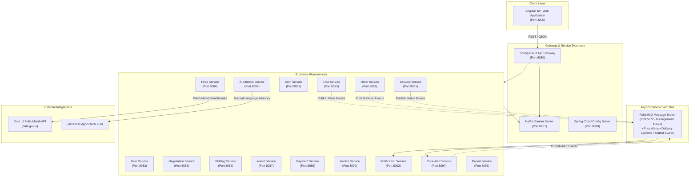

# 🌾 CropDeal — Enterprise Agricultural Marketplace & Supply Chain Platform

[](https://www.oracle.com/java/)
[](https://spring.io/projects/spring-boot)
[](https://spring.io/projects/spring-cloud)
[](https://angular.dev/)
[](https://www.rabbitmq.com/)
[](https://www.mysql.com/)
[](https://www.docker.com/)
[](LICENSE)

---

## 📌 Executive Summary

**CropDeal** is an enterprise-grade, distributed B2B AgriTech e-commerce and supply chain logistics platform engineered with a **microservices architecture** using **Spring Boot 3.3.13**, **Spring Cloud 2023.0.6**, and an **Angular 18+ Standalone** frontend. 

The platform directly bridges the gap between **Farmers (Producers)**, **Dealers (Wholesale Buyers)**, **Logistics & Delivery Partners**, and **Platform Administrators**. By eliminating exploitative intermediaries, integrating Government of India Mandi price benchmarks, orchestrating live crop bidding with an escrow wallet, and offering real-time delivery milestone tracking with Rule 46 CGST-compliant tax invoices, CropDeal establishes a fair, transparent, and resilient agricultural economy.

---

## 🏛️ High-Level System Architecture

CropDeal follows the **Database-per-Service** design pattern with dynamic service discovery, reactive API gateway routing, and event-driven asynchronous messaging via RabbitMQ.



---

## 🧩 Microservices Topology & Port Directory

The platform comprises **17 dedicated Spring Boot microservices** communicating via OpenFeign and RabbitMQ:

| Service Name | Port | Database Schema | Primary Responsibilities |
|---|:---:|---|---|
| **`eureka-server`** | `8761` | — | Dynamic service discovery, instance heartbeat tracking, service registry |
| **`config-server`** | `8888` | — | Centralized configuration management across all microservice profiles |
| **`api-gateway`** | `8080` | — | Reverse proxy, dynamic Eureka routing, CORS enforcement, unified JWT validation |
| **`auth-service`** | `8081` | `cropdeal_auth_db` | Multi-role registration & login, BCrypt hashing, JWT issuance & token verification |
| **`user-service`** | `8082` | `cropdeal_user_db` | Farmer/Dealer profiles, KYC verification, reviews & ratings aggregation, admin moderation |
| **`crop-service`** | `8083` | `cropdeal_crop_db` | Crop catalog, live stock tracking, batch filtering, image upload handling |
| **`price-service`** | `8084` | `cropdeal_price_db` | Govt. of India data.gov.in Mandi prices sync with district-to-state fallback caching |
| **`negotiation-service`** | `8085` | `cropdeal_negotiation_db` | Direct dealer-farmer price bargaining, discount threshold checks, counter-offers |
| **`bidding-service`** | `8086` | `cropdeal_bidding_db` | Live crop auctions, incremental bidding engine, Feign integration with Wallet & Orders |
| **`wallet-service`** | `8087` | `cropdeal_wallet_db` | Escrow digital wallet, JPA `@Version` optimistic locking, credit/debit/reserve holds |
| **`order-service`** | `8088` | `cropdeal_order_db` | Order lifecycle (`CREATED`, `PAID`, `SELF_PICKUP`, `DELIVERED`), quantity deductions |
| **`payment-service`** | `8089` | `cropdeal_payment_db` | Payment gateway integration, crop stock purchases, delivery fee payments, refunds |
| **`invoice-service`** | `8090` | `cropdeal_invoice_db` | OpenPDF Rule 46 CGST-compliant tax invoices, itemized HSN codes, PDF downloads |
| **`deliveryservice`** | `8091` | `cropdeal_delivery_db` | Global Delivery Pool, ₹100 static fee logistics, agent claiming, milestone updates |
| **`notification-service`** | `8092` | `cropdeal_notification_db` | RabbitMQ event consumer, user-scoped alerts, SMS/Email dispatch simulations |
| **`price-alert-service`** | `8094` | `cropdeal_price_alert_db` | Real-time price threshold triggers, buyer demand matching, deduplication engine |
| **`report-service`** | `8095` | — | Aggregated platform analytics, sales volumes, commission reports, system metrics |
| **`chatbot-service`** | `8096` | `chatbot_db` | AI conversational agricultural assistant powered by Sarvam AI LLM integration |
| **`cropdeal-ui`** | `4200` | LocalStorage / Cache | Angular 18+ Standalone responsive client with role-based navigation and glassmorphic UI |

---

## 🚀 Key Business Features & Engineering Highlights

### 1. 🛡️ Role-Based Access Control (RBAC)
- Four distinct platform personas: **Farmer (`ROLE_FARMER`)**, **Dealer (`ROLE_DEALER`)**, **Delivery Partner (`ROLE_DELIVERY_PARTNER`)**, and **System Administrator (`ROLE_ADMIN`)**.
- Stateless authentication using **JSON Web Tokens (JWT)** signed with HMAC-SHA512.
- Granular endpoint security across microservices with customized pre-authorization filters.

### 2. 📊 Real-Time Mandi Benchmark Pricing (Govt. of India)
- Directly integrates with the official **data.gov.in Agricultural Marketing Information Network (AGMARKNET)** API.
- Implements intelligent multi-tier caching with **district-level fallback to state-level median pricing**, ensuring farmers and dealers negotiate with verified market realities.

### 3. 🤝 Direct Price Negotiation Engine
- Dealers can submit direct bargaining requests for listed crops.
- **Strict Discount Validation**: Dealers can only propose prices **strictly below the original listed crop price** (`proposedPrice < listedPrice`).
- Farmers can accept, reject, or propose a counter-offer.
- Accepted negotiations allow dealers to purchase stock at the negotiated rate with full support for partial order checkout.

### 4. 📦 Automated Stock Lifecycle & Depletion Management
- **Atomic Stock Deduction**: Real-time deduction across direct purchases and negotiated order flows.
- **Prominent Stock Visibility**: Every crop card displays the **Available Quantity** and **Remaining Stock** in real-time.
- **Conditional Post Deletion**: When an order is placed partially, the crop post **persists** with updated stock. The crop listing is automatically decommissioned and deleted **only when remaining stock reaches zero**.
- **Checkout Guardrails**: Dealers cannot select or purchase quantities exceeding the currently available crop quantity.

### 5. 🏷️ Live Bidding Floor & Escrow Wallet
- Farmers can create time-boxed auction lots with custom base prices and minimum bid increments.
- **Digital Escrow Wallet**: Placing a bid automatically reserves funds from the dealer's wallet.
- **Automated Outbid Releases**: When a higher bid is registered, previously held funds are immediately released back to the outbid dealer.
- **Concurrency Safety**: High-volume bidding spikes are protected using JPA `@Version` **optimistic locking**, preventing race conditions and double-spending.

### 6. 🚚 Dual Fulfillment Logistics Architecture
- **Path A — Farmer Direct Self-Pickup (₹0 Fee)**:
  - Zero logistics cost for local or bulk buyers.
  - No delivery agent assigned; order transitions directly into self-pickup fulfillment.
- **Path B — Global Delivery Partner Pool (₹100 Flat Fee)**:
  - Dealer pays a static ₹100 delivery fee upfront.
  - The job enters the **Global Delivery Pool** in status `AVAILABLE_FOR_PICKUP`.
  - Nearby verified delivery agents can claim the job and advance through milestone stages:
    $$\text{ORDERED} \longrightarrow \text{PROCESSING} \longrightarrow \text{PICKED\_UP} \longrightarrow \text{IN\_TRANSIT} \longrightarrow \text{DELIVERED}$$
  - Delivery status updates reflect instantly across the dealer's order dashboard.

### 7. 📬 Asynchronous Event-Driven Messaging (RabbitMQ)
- Utilizes RabbitMQ exchanges and queues for decoupling critical platform operations:
  - `cropdeal.notification.exchange` dispatches price alerts, outbid notices, negotiation responses, and order delivery updates.
  - **User-Specific Notification Routing**: Strict routing rules ensure farmers only receive producer notifications, dealers only receive buyer notifications, and delivery partners receive logistics alerts.
  - **Deduplication Engine**: Backed by a dedicated database constraint `(subscription_id, source_type, source_id)` to eliminate duplicate alert spam.

### 8. 📄 Certified GST Tax Invoice Generation (Rule 46 CGST Act)
- Generated on the fly using **OpenPDF**.
- Fully compliant with Rule 46 of the Indian CGST Rules:
  - Official Tax Invoice header with unique Serial Number & Invoice Date
  - Seller (Farmer) details & Buyer (Dealer) details with state code & GSTIN
  - Itemized crop details with HSN Codes, unit quantity, and rate
  - Accurate CGST (2.5%) and SGST (2.5%) or IGST (5%) calculations
  - Authorized digital signatory seal and payment confirmation status

### 9. 🤖 AI Agricultural Advisory Assistant (Sarvam AI)
- Embedded chatbot powered by **Sarvam AI** specialized in Indic agricultural language models.
- Provides real-time guidance on weather forecasts, crop disease remedies, fertilizer recommendations, and market demand predictions.

### 10. ⭐ Farmer Rating, Review & Admin Moderation
- Post-delivery rating system allowing dealers to evaluate crop quality, fulfillment speed, and farmer communication.
- Real-time aggregation of farmer ratings (1 to 5 stars).
- Full Admin moderation suite with audit logs, review deletion, and one-click farmer account suspension/unblocking.

---

## 💻 Technology Stack

### Backend
- **Core Framework**: Spring Boot `3.3.13`, Spring Cloud `2023.0.6`
- **Language**: Java 17 / Java 21 (LTS)
- **Security**: Spring Security 6, JWT (jjwt 0.11.5), BCrypt
- **Service Mesh & Routing**: Netflix Eureka Server, Spring Cloud Gateway
- **Inter-Service Communication**: OpenFeign, Spring WebClient
- **Asynchronous Messaging**: RabbitMQ (AMQP 0-9-1) with Spring AMQP
- **Data & Persistence**: Spring Data JPA, Hibernate ORM, MySQL Connector/J
- **Document Generation**: OpenPDF 1.3.30
- **Documentation**: SpringDoc OpenAPI 2.5 (Swagger UI 3)

### Frontend
- **Framework**: Angular 18/19 Standalone Architecture
- **Language**: TypeScript 5.4+, HTML5, SCSS
- **State & Reactive Streams**: RxJS 7.8+, Signals
- **Visuals & Charts**: Chart.js, Canvas, Responsive Glassmorphic Theme

### Infrastructure & DevOps
- **Relational Databases**: MySQL 8.0 (13 distinct schemas via `init.sql`)
- **Message Broker**: RabbitMQ 3.13 Management Container
- **Containerization**: Docker, Docker Compose
- **Build Tools**: Apache Maven 3.8+, Node.js 18+ / npm

---

## 🗄️ Database Architecture (Database-per-Service)

CropDeal enforces complete data isolation. The relational schemas initialized via [`init.sql`](file:///D:/cropdealnaresh/init.sql) are:

```sql
cropdeal_auth_db          -- Users, credentials, BCrypt hashes, roles
cropdeal_user_db          -- Profiles, addresses, bank accounts, ratings
cropdeal_crop_db          -- Crop listings, stock levels, images, categories
cropdeal_price_db         -- Mandi benchmark prices cache, AGMARKNET sync
cropdeal_negotiation_db   -- Bargaining history, offer/counter-offer status
cropdeal_bidding_db       -- Auction lots, live bid history, winner data
cropdeal_wallet_db        -- Ledger balances, escrow holds, versioning
cropdeal_order_db         -- Purchase orders, itemized lines, order status
cropdeal_payment_db       -- Transaction records, payment receipts, refunds
cropdeal_invoice_db       -- Generated invoice records, tax numbers
cropdeal_delivery_db      -- Global delivery pool, transit coordinates
cropdeal_notification_db   -- Dispatched notifications, delivery alerts
cropdeal_price_alert_db   -- Subscription thresholds, deduplication index
chatbot_db                -- Chat session history and context logs
```

---

## ⚡ Quick Start & Setup Guide

### 📋 Prerequisites
Ensure the following tools are installed on your environment:
- **Java Development Kit (JDK)**: Version 17 or 21
- **Apache Maven**: Version 3.8+ (or use the included `mvnw.cmd` / `./mvnw`)
- **Node.js**: Version 18.x or 20.x & **npm**
- **Docker & Docker Desktop**: For running MySQL and RabbitMQ containers
- **PowerShell** (Windows) or **Bash** (macOS/Linux)

---

### Step 1: Clone the Repository
```bash
git clone https://github.com/<your-username>/cropdeal.git
cd cropdeal
```

---

### Step 2: Start Infrastructure (MySQL & RabbitMQ)

You can spin up MySQL and RabbitMQ instantly via Docker Compose:

```bash
# Starts MySQL 8.0 and RabbitMQ with Management UI
docker compose up -d mysql rabbitmq
```

> **Manual MySQL Setup**: If running MySQL locally without Docker, run the provided [`init.sql`](file:///D:/cropdealnaresh/init.sql) script in MySQL Workbench or CLI to create all 13 databases and the default user (`naresh` / `vnaresh2004`).

---

### Step 3: Compile All Microservices
```bash
# Compile and build all 17 microservices skipping tests
./mvnw clean package -DskipTests
```
*(On Windows: `.\mvnw.cmd clean package -DskipTests`)*

---

### Step 4: Launch All Services (One-Click)

#### Option A: Using PowerShell Launcher (Recommended on Windows)
```powershell
.\start-all.ps1
```
*(This automatically launches Eureka Server, Config Server, all 15 business services, the API Gateway, and the Angular UI in separate titled processes with optimized memory parameters).*

#### Option B: Using Docker Compose
```bash
docker compose up --build -d
```

#### Option C: Manual Ordered Startup Sequence
If starting services manually, start in this strict order:
1. **Service Discovery**: `eureka-server` (Port `8761`)
2. **Configuration**: `config-server` (Port `8888`)
3. **Core Services**:
   - `auth-service` (Port `8081`)
   - `user-sevice` (Port `8082`)
   - `crop-service` (Port `8083`)
   - `price-service` (Port `8084`)
   - `negotiation-service` (Port `8085`)
   - `bidding-service` (Port `8086`)
   - `wallet-service` (Port `8087`)
   - `order-service` (Port `8088`)
   - `payment-service` (Port `8089`)
   - `invoice-service` (Port `8090`)
   - `deliveryservice` (Port `8091`)
   - `notification-service` (Port `8092`)
   - `price-alert-service` (Port `8094`)
   - `report-service` (Port `8095`)
   - `chatbot-service` (Port `8096`)
4. **API Gateway**: `api-gateway` (Port `8080`)
5. **Frontend UI**: `cropdeal-ui` (Port `4200`)

---

### Step 5: Start Angular Frontend
```bash
cd cropdeal-ui
npm install
npm start
```
The application will be live at **`http://localhost:4200`**.

---

## 🔑 Pre-Seeded Default Credentials

For rapid end-to-end testing, the platform includes pre-configured personas:

| Role | Email | Password | Access Capabilities |
|---|---|---|---|
| **Administrator** | `admin@cropdeal.com` | `Admin@123` | Platform analytics, user moderation, dispute management, review audits |
| **Farmer (Producer)** | `farmer@cropdeal.com` | `Farmer@123` | Upload crops, view mandi benchmarks, counter negotiations, manage auctions |
| **Dealer (Buyer)** | `dealer@cropdeal.com` | `Dealer@123` | Browse catalog, negotiate price, place bids, top-up wallet, download GST invoices |
| **Delivery Partner** | `delivery@cropdeal.com` | `Delivery@123` | Access Global Delivery Pool, claim shipments, update live milestone stepper |

---

## 📖 Swagger / OpenAPI Interactive Documentation

Every microservice exposes OpenAPI 3 documentation with interactive Swagger UI endpoints:

- **API Gateway (Unified Docs)**: [http://localhost:8080/swagger-ui.html](http://localhost:8080/swagger-ui.html)
- **Auth Service**: [http://localhost:8081/swagger-ui.html](http://localhost:8081/swagger-ui.html)
- **User Service**: [http://localhost:8082/swagger-ui.html](http://localhost:8082/swagger-ui.html)
- **Crop Service**: [http://localhost:8083/swagger-ui.html](http://localhost:8083/swagger-ui.html)
- **Price Service**: [http://localhost:8084/swagger-ui.html](http://localhost:8084/swagger-ui.html)
- **Negotiation Service**: [http://localhost:8085/swagger-ui.html](http://localhost:8085/swagger-ui.html)
- **Bidding Service**: [http://localhost:8086/swagger-ui.html](http://localhost:8086/swagger-ui.html)
- **Wallet Service**: [http://localhost:8087/swagger-ui.html](http://localhost:8087/swagger-ui.html)
- **Order Service**: [http://localhost:8088/swagger-ui.html](http://localhost:8088/swagger-ui.html)
- **Payment Service**: [http://localhost:8089/swagger-ui.html](http://localhost:8089/swagger-ui.html)
- **Invoice Service**: [http://localhost:8090/swagger-ui.html](http://localhost:8090/swagger-ui.html)
- **Delivery Service**: [http://localhost:8091/swagger-ui.html](http://localhost:8091/swagger-ui.html)
- **Notification Service**: [http://localhost:8092/swagger-ui.html](http://localhost:8092/swagger-ui.html)
- **Price Alert Service**: [http://localhost:8094/swagger-ui.html](http://localhost:8094/swagger-ui.html)
- **Report Service**: [http://localhost:8095/swagger-ui.html](http://localhost:8095/swagger-ui.html)
- **Chatbot Service**: [http://localhost:8096/swagger-ui.html](http://localhost:8096/swagger-ui.html)
- **Eureka Dashboard**: [http://localhost:8761](http://localhost:8761)
- **RabbitMQ Management**: [http://localhost:15672](http://localhost:15672) *(guest / guest)*

---

## 🧪 Postman Automated Test Suite

A complete, production-ready Postman collection [`CropDeal.postman_collection.json`](file:///D:/cropdealnaresh/CropDeal.postman_collection.json) is included in the root directory. It contains **39+ automated tests** across 11 modules:

1. `01. Authentication & Profile` (Admin, Farmer, Dealer, and Delivery Partner registration & JWT retrieval)
2. `02. Crop Catalog & Mandi Price Engine` (Crop creation, filtering, Govt. benchmark lookup)
3. `03. Direct Price Negotiation` (Discount proposal, validation check, counter-offers, acceptance)
4. `04. Bidding & Escrow Wallet` (Wallet balance credit, live auction lot creation, wallet escrow reservation)
5. `05. Orders & Stock Payment` (Order placement, quantity deduction verification, stock payment)
6. `06. Fulfillment - Path A: Self-Pickup` (Zero-fee self-pickup fulfillment)
7. `07. Fulfillment - Path B: Delivery Partner & Global Pool` (Static ₹100 fee, pool job claiming, milestone stepper)
8. `08. Invoicing & PDF Receipts` (Rule 46 CGST Tax invoice generation and PDF stream download)
9. `09. Reviews, Ratings & Admin Moderation` (5-star ratings, aggregate recalculations, admin sanctions)
10. `10. AI Chatbot Assistant` (Sarvam AI agricultural conversational testing)
11. `11. Advanced Price Alert Engine` (Threshold subscriptions, real-time matching, deduplication checks)

To execute the suite:
1. Open **Postman** and click **Import**.
2. Select [`CropDeal.postman_collection.json`](file:///D:/cropdealnaresh/CropDeal.postman_collection.json).
3. Set the environment variable `baseUrl` to `http://localhost:8080`.
4. Click **Run Collection**.

---

## 📂 Repository Directory Structure

```plaintext
cropdeal/
├── api-gateway/               # Spring Cloud API Gateway (Port 8080)
├── auth-service/              # JWT & BCrypt Authentication Service (Port 8081)
├── bidding-service/           # Live Crop Auction & Bidding Floor (Port 8086)
├── chatbot-service/           # Sarvam AI Agricultural Assistant (Port 8096)
├── config-server/             # Spring Cloud Config Server (Port 8888)
├── crop-service/              # Crop Catalog & Inventory Management (Port 8083)
├── cropdeal-ui/               # Angular 18+ Standalone Web Client (Port 4200)
├── deliveryservice/           # Global Delivery Pool & Milestone Logistics (Port 8091)
├── eureka-server/             # Netflix Eureka Service Discovery (Port 8761)
├── invoice-service/           # OpenPDF Rule 46 CGST Tax Invoicing (Port 8090)
├── negotiation-service/       # Direct Price Bargaining Engine (Port 8085)
├── notification-service/      # RabbitMQ Event-Driven Notifications (Port 8092)
├── order-service/             # Order Processing & Stock Deductions (Port 8088)
├── payment-service/           # Payment Processing & Gateway Webhooks (Port 8089)
├── price-alert-service/       # Price Subscriptions & Real-Time Matching (Port 8094)
├── price-service/             # Govt. Mandi API AGMARKNET Integration (Port 8084)
├── report-service/            # Platform Analytics & Commission Reports (Port 8095)
├── user-sevice/               # User Profiles, Reviews & Admin Moderation (Port 8082)
├── wallet-service/            # Escrow Wallet with Optimistic Locking (Port 8087)
├── uploads/                   # Runtime image uploads (crops & bidding)
├── CropDeal.postman_collection.json # Automated 39+ request test suite
├── docker-compose.yml         # Containerized cluster orchestration
├── init.sql                   # MySQL 13-database schema initialization
├── pom.xml                    # Root Maven multi-module parent POM
├── start-all.ps1              # PowerShell master system launcher
├── stop-all.ps1               # PowerShell graceful shutdown script
├── .gitignore                 # Production-grade Git ignore configuration
└── README.md                  # Comprehensive platform documentation
```

---

## 🤝 Contributing

Contributions are welcome! Please follow these steps:
1. **Fork** the repository.
2. Create your feature branch (`git checkout -b feature/AmazingFeature`).
3. Commit your changes (`git commit -m 'feat: Add AmazingFeature'`).
4. Push to the branch (`git push origin feature/AmazingFeature`).
5. Open a **Pull Request**.

---

## 📜 License

Distributed under the **MIT License**. See `LICENSE` for more information.

---

<p align="center">
  <b>Built with ❤️ for Indian Farmers and the Agricultural Community.</b>
</p>
